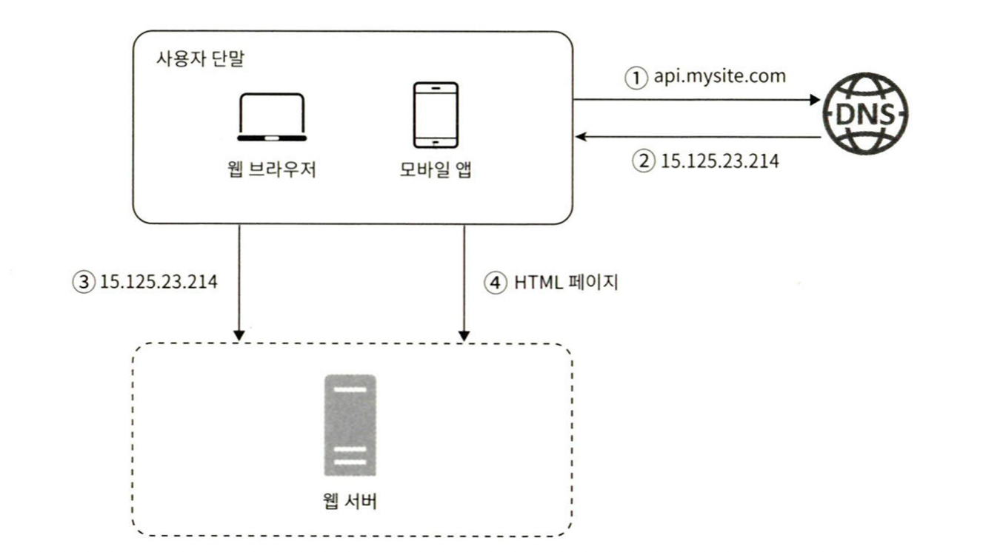
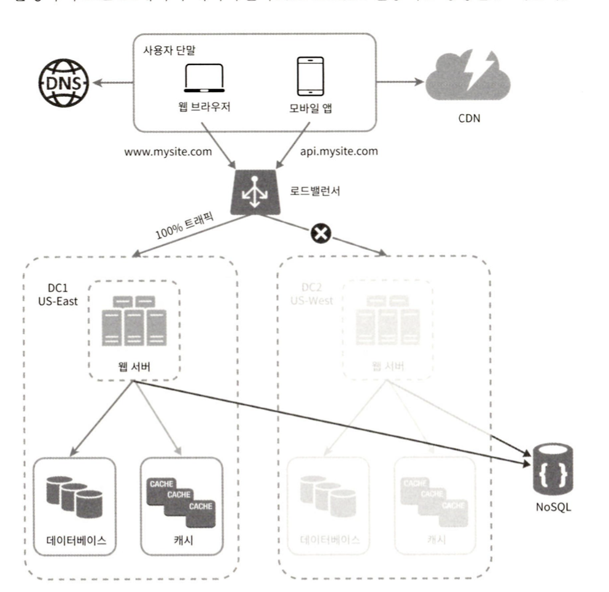

# 1. 사용자 수에 따른 규모 확장성

## 1.1 단일서버

- 모든 컴포넌트가 단 한대의 서버에서 실행되는 간단한 시스템을 설계해보자!

    - 사용자 요청의 흐름
        1. 사용자는 도메인 이름을 이용하여 웹사이트 접속. 
           - 도메인 이름을 이용하여 DNS에 질의
        2. DNS 조회 결과 IP 주소 반환. 웹 서버의 주소이다.
        3. 해당 IP 주소로 HTTP 요청이 전달된다.
        4. 요청 받은 웹서버는 HTML 페이지나 JSON 형태 응답 반환.

## 1.2 데이터베이스

- 사용자가 늘면 서버 하나로는 충분치 않아서 여러 서버를 두어야 한다. 하나는 웹/모바일 트래픽처리용, 다른 하나는 데이터베이스용이다.

### 어떤 데이터 베이스를 사용할 것인가?
**관계형 데이터베이스** <-> **비관계형 데이터베이스**

- 비관계형 데이터베이스 바람직한 선택인 경우
  - 아주 낮은 응답 지연시간이 요구됨.
  - 다루는 데이터가 비정형이라 관계형 데이터가 아님.
  - 데이터를 직렬화하거나 역질렬화 할 수 있기만 하면 됨
  - 아주 많은 양의 데이터를 저장할 필요가 있음

## 1.3 수직적 규모 확장 (스케일 업) vs 수평적 규모 확장 (스케일 아웃)

**수직적 규모 확장**
- 서버에 고사양 자원을 추가하는 행위.

**수평적 규모 확장**
- 더 많은 서버를 추가하여 성능 개선하는 행위.
   

서버로 유입되는 트래픽 양이 적을 때는 수직적 확장이 좋은 선택이며, 이 방법의 가장 큰 장점은 단순함이다.
- 한계가 있다. 한 대의 서버에 CPU나 메모리를 무한대로 증설할 방법은 없다.
- 자동복구(failover) 방안이나 다중화 방안을 제시하지 않는다. 서버에 장애가 발생하면 서비스는 완전히 중단된다.

앞서 본 설계에서 사용자는 웹 서버에 바로 연결된다.
- 웹 서버가 다운되면 사용자는 웹 사이트에 접속할 수 없다.
- 너무 많은 사용자가 접속하여 웹 서버가 한계 상황에 도달하게 되면 응답 속도가 느려지거나 서버 접속이 불가능해질 수도 있다.

-> 이런 문제를 해결하는 데는 **부하 분산기** 또는 **로드밸런스**를 도입하는것이 최선이다.

### 로드밸런서
- 로드밸런서는 부하 분산 집합에 (load balancing set)에 속한 웹 서버들에게 트래픽 부하를 고르게 분산하는 역할을 한다.
  
  - 로드밸런서의 public IP 주소로 접속한다.
  - 웹 서버는 클라이언트의 접속을 직접 처리하지 않는다.
  - 더 나은 보안을 위해, 서버 간 통신에는 private IP 주소가 이용된다.
- 서버 1 이 다운되면, 서버 2로 모든 트래픽이 전송된다. 따라서 웹 사이트 전체가 다운되는 일이 **방지**된다.
- 웹사이트로 유입되는 트래픽이 가파르게 증가하면, 로드밸랜서가 있으므로 우아하게 대처할 수 있다. 로드밸런스가 자동적으로 트래픽을 분산하기 시작할 것이다.

### 데이터베이스 다중화
- 보통은 서버 사이에 **master-slave** 관계를 설정하는 방식을 사용한다.
  - 쓰기 연산은 **master** 에서만 지원한다. (insert, delete, update)
  - 읽기 연산은 **slave** d에서 담당한다.
  - 대부분의 애플리케이션은 연산의 비중이 쓰기 연산 보다 읽기 연산이 훨씬 높다.
  
 데이터베이스 다중화로 인한 장점.
  
  - 더 나은 성능 
    - 병렬로 처리될 수있는 질의(query) 수가 늘어나므로, 성능이 좋아진다.
  - 안정성
    - 데이터베이스 서버 가운데 일부가 파괴되어도 데이터는 보전된다.
  - 가용성
    - 하나의 데이터베이스 서버에 장애가 발생하더라도 다른 서버에 있는 데이터를 가져와 계속 서비스할 수 있다.   

  데이터베이스 다중화 후 하나가 다운되면 발생할 수 있는 상황
  - slave 서버가 한 대 뿐인데 다운된다면, 읽기 연산은 한시적으로 모두 master 로 전달될 것이다. 또한 즉시 새로운 데이터베이스가 장애서버를 대체할 것이다.
  - master 서버가 다운되면, 한 대의 slave 데이터베이스가 master 가 될 것이며, 모든 데이터베이스 연산은 Master 에서 이루어진다.
    - **Slave 데이터가 최신 상태가 아닐겨우?**
      - 없는 데이터는 복구 스크립트를 돌려서 추가해야한다.
      - **다중 마스터**나 **원형 다중화**방식을 도입하면 도움이 된다.

## 캐시 
- 캐시는 값비싼 연산 결과 또는 자주 참조되는 데이터를 메모리 안에 두고, 뒤 이은 요청이 보다 빨리 처리될 수 있도록 하는 저장소이다.
- 애플리케이션의 성능은 데이터베이스를 얼마나 자주 호출하느냐에 크게 좌우되는데, 캐시는 그런 문제르르 완화할 수 있다.

### 캐시 계층
- 캐시 계층은 데이터가 잠시 보관되는 곳으로 데이트베이스보다 훨씬 빠르다.
- 성능 개선 뿐만 아니라 데이터베이스 부하를 줄일 수 있고, 캐시 계층의 규모를 독립적으로 확장시키는 것도 가능하다.
  
**주도형 캐시 전략**
- 캐시에 있다면 해당 데이터 반환, 없으면 디비 질의를 통해 결과를 얻은 후 캐시에 저장한 뒤 클라이언트에 반환.

### 캐시 사용시 유의할 점
- **캐시는 어떤 상황에 바람직한가?**
  - 데이터 갱신은 자주 일어나지 않지만, 참조는 빈번하게 일어난다면!
- **어떤 데이터를 캐시에 두어야 하는가?**
  - 캐시는 데이터를 **휘발성 메모리**에 두므로, 영속적으로 보관할 데이터를 캐시에 두는 것은 바람직하지 않다.
- **캐시에 보관된 데이터는 어떻게 만료되는가?**
  - 정책을 만들어야한다. 
  - 만료 정책이 없으면 데이터는 캐시에 계속 남게 된다.
  - 만료 기한은 너무 짧으면, 디비를 너무 자주 읽게 된다.
  - 너무 길으면, 원본과 차이가 날 가능성이 높아진다.
- **일관성은 어떻게 유지되는가?**
  - 저장소의 원본을 갱신하는 연산과 캐시를 갱신하는 연산이 단일 트랜잭션으로 처리되지 않는 경우 이 일관성은 깨질수있다.
- **장애에는 어떻게 대처할 것인가**
  - 캐시 서버를 한 대만 두는 경우 해당 서버는 단일 장애 지점이 될 수 있다.
- **캐시 메모리는 얼마나 크게 잡을 것인가?**
  - 캐시 메모리가 너무 작으면 액세스 패턴에 따라서는 데이터가 너무 자주 캐시에 미려나버려 캐시의 성능이 떨어진다.
- **데이터 방출(eviction) 정책?**
  - 캐시가 꽉 차버리면 추가로 캐시에 데이터를 넣어야 할 경우 기존 데이터를 내보내야 한다.
  - **LRU(Least Recently Used)** 마지막으로 사용된 시점이 가장 오래된 데이터를 내보내는 정책. 또는 FIFO

## 콘텐츠 전송 네트워크 (CDN)
- 정적 콘텐츠를 전송한데 쓰이는, 지리적으로 분산된 서버의 네트워크. 이미지, 비디오, CSS< Javascript 파일 등을 캐시할 수 있다.
- 요청 경로 ( Request path), 질의 문자열 (query string), 쿠키, 요청 헤더 등의 정보에 기반하여 HTML 페이지를 **캐시**하는 것이다.

- 어떤 사용자가 웹사이트를 방문하면, 그 사용자에게 가장 가까운 CDN 서버가 정적 콘텐츠를 전달하게 된다. 
  - 예를 들어, CDN 서버가 센프란시스코에 있다면 LA 에 있는 유럽 사용자보다 빠른 웹사이트를 보게 될 것이다.

1. 사용자 A가 이미지 URL 을 이용해 image.png 에 접근한다. (Cloudfront, Akamai)
2. CDN 서버의 캐시에 해당 이미지가 없는 경우, 서버는 우너본서버에 요청하여 파일을 가져온다.
3. 원본 서버가 파일을 CDN 서버에 반환한다. 응답의 HTTP 헤더에는 해당 파일이 얼마나 오래 캐시될 수 있는지를 나타내는 TTL 값이 들어있다.
4. CDN 서버는 파일클 캐시하고 사용자 A 에게 반환한다.
5. 사용자 B가 같은 이미지에 대한 요청을 CDN 서버에 한다.
6. 만료되지 않은 이미지에 대한 요청은 캐시를 통해 처리한다.

### CDN 사용시 고려할 사항
- **비용**
  - CDN 은 보통 제 3 사업자에 의해 운영되며 데이터 전송양에 따라 요금을 낸다.
  - 자주 사용되지 않는 콘텐츠를 캐싱하는 것은 이득이 크지 않으므로, CDN 에서 뺴는 것을 고려하자
- **적절한 만료 시한 설정**
- **CDN 장애에 대한 대처 방안**
  - CDN 자체가 죽었거나 일시적으로 응답하지 않을 경우에 대비하여, 클라이언트를 구성하는 것이 필요하다.
- **콘텐츠 무효화**

## 무상태(Stateless) 웹 계층
- 이제 웹 계층을 수평적으로 확장하는 방버을 고민해 볼 순서다.
- 이를 위해서는 상태 정보 ( 사용자 세션 데이터와 같은)을 웹 계층에서 제거해야 한다.
    - 바람직한 전략은 상태 정보를 디비나 NoSQL 같은 저장소에 보관하고, 필요할 때 가져오도록 하는 것이다.
  

### 상태 정보 의존적인 아키텍처
- 상태를 유지하여 요청들 사이에 공유되도록 한다.
  
  - 같은 클라이언트로부터의 요청은 항상 같은 서버로 전송되어야 한다.
  - 대부분의 로드밸런서가 이를 지원하기 위해 **고정 세션(sticky session)** 이라는 기능을 제공하는데, 이는 로드밸런스에 부담을 준다.
  - 게다가 로드밸런서 뒷단에 서버를 추가하거나 제거하기도 까다로워진다. 이들 서버의 장애를 처리하기도 복잡해진다.

### 무상태 아키텍처

- 이 구조에서 사용자로부터의 HTTP 요청은 어떤 웹 서버로도 전달될 수 있다.

## 데이터 센터
- 장애가 없는 상황에서 사용자는 가장 가까운 데이터 센터로 안내 되는데, 이를 **지리적 라우팅 ( geo - routing)** 이라고 부른다.
- geoDNS 는 사용자의 위치에 따라 도메인 이름을 어떤 IP 주소로 변환할지 결정할 수 있도록 해주는 DNS 서비스 이다.

- 다중 데이터 센터 아키텍처를 만들려면 몇 가지 기술적 난제를 해결해야한다.
- **트래픽 우회**
- **데이터 동기화**
  - 장애가 자동으로 북고(failover)되어도 트래픽이 다른 데이터베이스로 우회한다 해도, 해당 데이터센터에는 찾는 데이터가 없을 수 있다. 
  - 데이터를 여러 데이터 센터에 걸쳐 다중화를 해야한다.
- **테스트와 배포**

## 메시지 큐
- 메시지 큐는 메시지의 무손실을 지원하는 컴포넌트.
- 메시지 큐를 이용하면 서비스 또는 서버 간 결헙이 느슨해져서, 규모 확장성이 보장되어야 하는 안정적 애플리케이션을 구성하 좋다.

## 데이터베이스의 규모 확장

### 수직적 확장 ( scale up )
- 기존 서버에 더 많은 고성능의 자원을 증설하는 방법.

- **문제점**
  - 하드웨어는 한계가 있으므로, 무한 증설 할 수 없다.
  - SPOF 로 인한 위험성이 있다.
  - 비용이 많이 든다.
### 수평적 확장 ( scale out)
- 샤딩이라고도 부르는데, 더 많은 서버를 추가.
- 샤딩은 대규모 데이터베이스를 샤드라고 부르는 작은 단위로 분할하는 기술을 일컫는다.
  - 모든 샤드는 같은 스키마를 쓰지만 샤드에 보관되는 데이터 사이에 중복이 없다.

    - 샤딩 전략을 구현할 때 가장 중요한 것은 샤딩 키를 어떻게 정하냐이다. 데이터를 고르게 분할 할 수 있도록 하는게 가장 중요하다.
  
- 샤딩의 문제점
  - **데이터 재 샤딩( resharding )**
    - 데이터가 너무 많아져서 하나의 샤드로는 더 이상 감당하기 어려울 때
    - 샤드 간 데이터 분포가 균등하지 못하여 어떤 샤드에 할당된 공간 소모가 다른 샤드에 비해 빨리 진행될 때
    -> 샤드 소진이라고도 부르는 이런 현상이 발생하면 샤드 키를 계산하는 함수를 변경하고 데이터를 재 배치하여야 한다.
  - **유명인사 (celebrity) 문제**
    - 특정 샤드에 질의가 집중되어 과부하 걸리는 문제다.
  - **조인과 비정규화**
    - 여러 샤드에 걸친 데이터를 조인하기가 힘들어진다.
      - 데이터베이스를 비정규화하여 하나의 테이블에서 질의가 수행될 수 있도록 하는 것.

